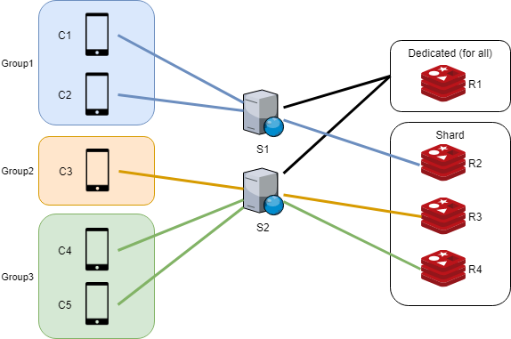

# Yoda.AspNetCore.SignalR.Redis.Sharding
This library is extension that provides multiple Redis server sharding to AspNetCore.SignalR.Redis.

It works as below.



This library has partition algorithm that It decide server below.

```
server_index = MD5(channel_name) mod server_count
```

# Configuration

The configuration that operates as shown above is as follows.

```csharp
public class Startup
{
    public void ConfigureServices(IServiceCollection services)
    {
        services.AddSignalR()
            .UseShardingRedis(options =>
            {
                options.Add("localhost:6379", true);    //R1
                options.Add("localhost:6380");          //R2
                options.Add("localhost:6381");          //R3
                options.Add("localhost:6382");          //R4
            });
    }
}
```

* R1 is for all-channel, R2 to R4 are for group-channel or user-channel.
* The parameter of the second argument means that it is a dedicated server for all-channel of PubSub.
* If this parameter is not set at all, one server is randomly decided. And this server works with all-channel, group-channel, user-channel.
* It works as a dedicated server for all-channel only when 'true' is set.
